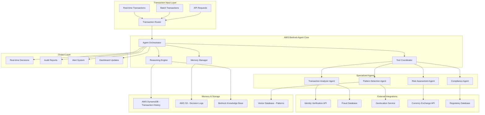

# AWS AI Agent Enhancement Design

## Overview

This design transforms the existing fraud detection system into a comprehensive AWS AI agent that meets enterprise standards. The enhanced system will use AWS Bedrock Agents for orchestration, implement advanced LLM reasoning, and provide autonomous decision-making with explainable AI capabilities.

## Architecture

### High-Level Architecture



### Component Architecture

The system follows a multi-agent architecture where specialized agents handle different aspects of fraud detection:

1. **Agent Orchestrator**: Central coordinator using AWS Bedrock Agents
2. **Reasoning Engine**: Advanced LLM-powered analysis with chain-of-thought
3. **Memory Manager**: Persistent storage and retrieval of decision context
4. **Specialized Agents**: Domain-specific fraud detection capabilities

## Components and Interfaces

### 1. Agent Orchestrator

**Purpose**: Central coordination and decision routing using AWS Bedrock Agent framework

**Key Features**:
- Request routing to appropriate specialized agents
- Decision aggregation and conflict resolution
- Workflow orchestration and task planning
- Integration with AWS Bedrock Agent runtime

**Interface**:
```python
class AgentOrchestrator:
    def process_transaction(self, transaction: Transaction) -> FraudDecision
    def coordinate_agents(self, analysis_request: AnalysisRequest) -> AgentResponse
    def resolve_conflicts(self, agent_decisions: List[AgentDecision]) -> FinalDecision
    def plan_analysis_workflow(self, transaction: Transaction) -> WorkflowPlan
```

### 2. Enhanced Reasoning Engine

**Purpose**: Advanced LLM reasoning with multi-step analysis and explainable decisions

**Key Features**:
- Chain-of-thought reasoning for complex fraud patterns
- Multi-step analysis with intermediate reasoning steps
- Confidence scoring and uncertainty handling
- Detailed explanation generation for audit trails

**Interface**:
```python
class ReasoningEngine:
    def analyze_with_reasoning(self, transaction: Transaction, context: Context) -> ReasoningResult
    def generate_explanation(self, decision: FraudDecision) -> ExplanationReport
    def assess_confidence(self, analysis: Analysis) -> ConfidenceScore
    def identify_reasoning_gaps(self, analysis: Analysis) -> List[InformationGap]
```

### 3. Memory Manager

**Purpose**: Persistent memory for learning, context retention, and pattern recognition

**Key Features**:
- Transaction history storage and retrieval
- Decision context preservation
- Pattern learning and adaptation
- User behavior profiling

**Interface**:
```python
class MemoryManager:
    def store_decision_context(self, transaction: Transaction, decision: FraudDecision)
    def retrieve_user_history(self, user_id: str) -> UserHistory
    def update_pattern_knowledge(self, new_patterns: List[FraudPattern])
    def get_similar_cases(self, transaction: Transaction) -> List[SimilarCase]
```

### 4. Specialized Agents

#### Transaction Analyzer Agent
- Real-time transaction processing
- Amount and currency analysis
- Merchant and location verification
- Velocity pattern detection

#### Pattern Detection Agent
- Historical pattern analysis
- Anomaly detection using ML models
- Behavioral pattern recognition
- Trend analysis and prediction

#### Risk Assessment Agent
- Multi-factor risk scoring
- Geographic risk analysis
- Temporal risk patterns
- Cross-reference with known fraud indicators

#### Compliance Agent
- Regulatory compliance checking
- Audit trail generation
- Report creation for authorities
- Policy enforcement

### 5. Tool Integration Layer

**Purpose**: Seamless integration with external APIs and services

**External Tools**:
- **Identity Verification**: Real-time identity checks
- **Fraud Databases**: Cross-reference with known fraud cases
- **Geolocation Services**: Location verification and risk assessment
- **Currency APIs**: Real-time exchange rates and currency risk
- **Regulatory Databases**: Compliance and sanctions checking

**Interface**:
```python
class ToolIntegrator:
    def verify_identity(self, user_data: UserData) -> IdentityResult
    def check_fraud_database(self, transaction: Transaction) -> FraudDatabaseResult
    def assess_location_risk(self, location: Location) -> LocationRisk
    def get_currency_info(self, currency: str) -> CurrencyInfo
    def check_sanctions(self, user_id: str) -> SanctionsResult
```

## Data Models

### Enhanced Transaction Model
```python
@dataclass
class EnhancedTransaction:
    id: str
    user_id: str
    amount: Decimal
    currency: str
    merchant: str
    category: str
    location: Location
    timestamp: datetime
    card_type: str
    device_info: DeviceInfo
    ip_address: str
    session_id: str
    metadata: Dict[str, Any]
```

### Reasoning Result Model
```python
@dataclass
class ReasoningResult:
    decision: FraudDecision
    reasoning_steps: List[ReasoningStep]
    confidence_score: float
    evidence: List[Evidence]
    explanation: str
    recommendations: List[str]
    escalation_needed: bool
```

### Agent Decision Model
```python
@dataclass
class AgentDecision:
    agent_id: str
    decision: FraudDecision
    confidence: float
    reasoning: str
    evidence: List[Evidence]
    processing_time: float
    tools_used: List[str]
```

### Memory Context Model
```python
@dataclass
class MemoryContext:
    user_history: UserHistory
    similar_transactions: List[Transaction]
    learned_patterns: List[FraudPattern]
    decision_history: List[PastDecision]
    risk_profile: RiskProfile
```

## Error Handling

### Error Categories
1. **Input Validation Errors**: Malformed transaction data
2. **External Service Errors**: API failures, timeouts
3. **Agent Communication Errors**: Inter-agent communication failures
4. **Memory Access Errors**: Database connection issues
5. **Reasoning Errors**: LLM processing failures

### Error Handling Strategy
- **Graceful Degradation**: Fall back to rule-based analysis if AI fails
- **Retry Logic**: Automatic retry with exponential backoff
- **Circuit Breaker**: Prevent cascade failures from external services
- **Error Logging**: Comprehensive error tracking for debugging
- **Fallback Decisions**: Safe default decisions when systems fail

### Implementation
```python
class ErrorHandler:
    def handle_llm_failure(self, transaction: Transaction) -> FraudDecision
    def handle_external_api_failure(self, service: str, transaction: Transaction) -> Decision
    def handle_memory_failure(self, transaction: Transaction) -> Decision
    def log_error_context(self, error: Exception, context: ProcessingContext)
```

## Testing Strategy

### Unit Testing
- Individual agent functionality
- Reasoning engine logic
- Memory operations
- Tool integrations
- Error handling scenarios

### Integration Testing
- Agent coordination workflows
- End-to-end transaction processing
- External API integrations
- Memory persistence and retrieval
- Real-time streaming capabilities

### Performance Testing
- High-volume transaction processing
- Concurrent agent operations
- Memory usage optimization
- Response time benchmarks
- Scalability testing

### AI/ML Testing
- Reasoning quality assessment
- Decision accuracy validation
- Explanation coherence testing
- Bias detection and mitigation
- Adversarial testing for robustness

### Test Implementation
```python
class AgentTestSuite:
    def test_reasoning_accuracy(self)
    def test_agent_coordination(self)
    def test_memory_consistency(self)
    def test_external_integrations(self)
    def test_performance_benchmarks(self)
    def test_explanation_quality(self)
```

## Deployment Architecture

### AWS Infrastructure
- **AWS Bedrock**: Agent runtime and LLM services
- **AWS Lambda**: Serverless agent execution
- **AWS DynamoDB**: Transaction and decision storage
- **AWS S3**: Audit logs and model artifacts
- **AWS API Gateway**: REST API endpoints
- **AWS EventBridge**: Event-driven processing
- **AWS CloudWatch**: Monitoring and alerting
- **AWS X-Ray**: Distributed tracing

### Scalability Design
- **Auto-scaling**: Dynamic scaling based on transaction volume
- **Load Balancing**: Distribute requests across multiple instances
- **Caching**: Redis for frequently accessed data
- **Async Processing**: Queue-based processing for non-critical operations
- **Regional Deployment**: Multi-region deployment for global availability

### Security Considerations
- **Encryption**: End-to-end encryption for sensitive data
- **Access Control**: IAM-based access control for AWS resources
- **Audit Logging**: Comprehensive audit trails for compliance
- **Data Privacy**: PII protection and data anonymization
- **Network Security**: VPC isolation and security groups

## Monitoring and Observability

### Key Metrics
- **Transaction Processing Rate**: Transactions per second
- **Decision Accuracy**: Fraud detection accuracy metrics
- **Response Time**: End-to-end processing latency
- **Agent Performance**: Individual agent success rates
- **Memory Utilization**: Memory usage and efficiency
- **External API Health**: Third-party service availability

### Alerting Strategy
- **Critical Alerts**: System failures, high error rates
- **Performance Alerts**: Response time degradation
- **Business Alerts**: Unusual fraud patterns, high-value transactions
- **Compliance Alerts**: Regulatory requirement violations

### Dashboard Design
- **Real-time Metrics**: Live transaction processing statistics
- **Agent Status**: Health and performance of individual agents
- **Decision Analytics**: Fraud detection trends and patterns
- **System Health**: Infrastructure and service status
- **Audit Reports**: Compliance and regulatory reporting