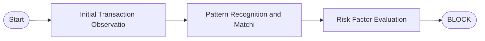
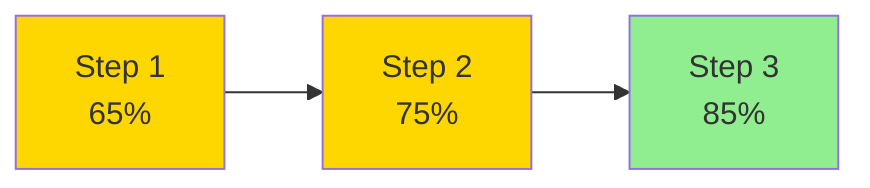

# Fraud Detection Decision Explanation

**Transaction ID:** txn_export
**Generated:** 2025-10-11T14:32:34.584535

## Executive Summary

Transaction flagged as fraudulent based on Unusual transaction amount, Unfamiliar merchant, Location mismatch with 82% confidence.

## Decision

- **Decision:** BLOCK
- **Confidence:** 82.0%
- **Risk Level:** HIGH

## Analysis Overview

Our fraud detection system performed a comprehensive analysis of this transaction. The analysis examined transaction patterns, user behavior, and risk indicators to determine the likelihood of fraudulent activity.

**Evidence:**

- Amount significantly exceeds user average
- Unfamiliar merchant category
- No similar transactions in history
- Velocity anomaly detected
- Multiple risk indicators present

## Key Findings

Key findings from the analysis: Unusual amount; High value transaction; Pattern deviation detected

**Evidence:**

- Amount significantly exceeds user average
- Unfamiliar merchant category
- Location mismatch
- No similar transactions in history
- Velocity anomaly detected
- Multiple risk indicators present
- Fraud probability: 85%

## Supporting Evidence

Supporting evidence: Amount significantly exceeds user average; Unfamiliar merchant category; Location mismatch; No similar transactions in history; Velocity anomaly detected; Multiple risk indicators present; Fraud probability: 85%

**Evidence:**

- Amount significantly exceeds user average
- Unfamiliar merchant category
- Location mismatch
- No similar transactions in history
- Velocity anomaly detected
- Multiple risk indicators present
- Fraud probability: 85%

## Recommendations

Block transaction immediately; Flag account for additional monitoring; Consider fraud investigation

**Evidence:**

- Block transaction immediately
- Flag account for additional monitoring
- Consider fraud investigation

## Key Factors

- Unusual transaction amount
- Unfamiliar merchant
- Location mismatch

## Recommendations

- Block transaction immediately
- Notify customer of security concern
- Initiate fraud investigation

## Visual Representations

### Decision Flow

### Confidence Progression

